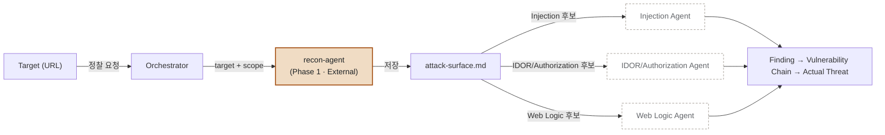

# recon-agent 팀 가이드

> ### ⚠️ 2026-08 dast-harness 이식됨
>
> 이 agent는 이제 팀 공용 하네스([dast-harness](https://github.com/moovingGun/dast-harness))
> 위에서 돈다. 바뀐 것:
>
> | 예전 | 지금 |
> |---|---|
> | `curl` / `nmap` / `ffuf` 직접 호출 | `dast-harness probe` (매 요청 `safety.py` 통과) |
> | `attack-surface.md` 자유 텍스트 3단 | `findings.json` — `AgentResult` 계약 |
> | `tools/validate_attack_surface.py` | `dast-harness ingest` |
> | 자체 lab-target | `targets/vulnerable_app` (정답지가 있어 **채점된다**) |
>
> 역할·경계·Safety Gate·탐색 절차는 그대로다. **배관만 갈아끼웠다.**
> 아래 문서 중 결정 로그·실험 기록은 **이식 이전** 시점의 것이며, 기록으로 보존한다.
> 지금 기준의 형식은 [`output-contract.md`](../.claude/skills/recon/reference/output-contract.md),
> 도구는 [`tools.json`](../.claude/skills/recon/reference/tools.json)을 본다.

> 이 문서를 처음 보는 팀원을 위한 안내서입니다. "이게 뭐 하는 agent인지", "어디까지 되고 어디부터 안 되는지"를 5분 안에 파악할 수 있게 정리했습니다. 프로젝트를 만들면서 있었던 시행착오(하네스 엔지니어링 결정 로그)까지 전부 보고 싶다면 [`../README.md`](../README.md)를 보세요 — 이 문서는 그중 "지금 결과물이 뭔가"만 추립니다.

## TL;DR

**recon-agent**는 Claude Code용 서브에이전트로, 승인된 대상 URL에 대해 **External Recon(외부 정찰)** 을 수행하고 그 결과를 다른 AI 에이전트가 바로 이어받아 쓸 수 있는 표준 파일로 저장합니다. 스스로 취약점을 판정하거나 공격을 실행하지 않습니다 — **"공격 표면(Attack Surface)을 구조화해서 정리해주는 정찰병"** 이라고 생각하면 됩니다.

| | |
|---|---|
| 무엇을 받나 | 대상 URL, 허용 스코프 |
| 무엇을 하나 | 정보수집 → 기술스택 추정 → Endpoint 탐색 → 요청 씨앗 작성 (포트 탐색·능동 브루트포스는 범위 밖) |
| 무엇을 내놓나 | `recon-output/<대상>/findings.json` (`AgentResult` — `request_seeds[]` + `findings[]`) |
| 무엇을 안 하나 | 실제 공격, 취약점 확정, 다음 agent 결정 |

## 1. 왜 이걸 만들었나

이 저장소가 검증하려는 질문은 하나입니다:

> "하나의 범용 AI에게 침투테스트 전 과정을 맡기는 것보다, **취약점 유형별로 전문화된 Agent를 조합**하는 방식이 실제 진단 업무에서 더 생산적인가?"

보안 전문가의 진단 절차를 사람이 하듯 단계별로 쪼개서, 각 단계를 전담하는 Agent를 만들고 필요한 순서로 조합하겠다는 접근입니다. 이 저장소는 그 파이프라인의 **가장 앞단, 정찰(Recon) 담당 Agent 하나만** 만드는 부분입니다. 후속 취약점 판정 Agent들은 아직 없습니다.

## 2. 전체 그림에서 recon-agent의 위치



**진하게 칠해진 `recon-agent`만 이 저장소에 실제로 존재합니다.** 점선인 3개 후속 Agent(Injection / IDOR·Authorization / Web Logic)는 아직 미구현이고, 이 저장소 범위 밖입니다. recon-agent는 저 후속 Agent들이 뭘 부를지 판단조차 하지 않습니다 — Orchestrator가 `attack-surface.md`의 카테고리 태그를 보고 결정합니다.

## 3. 역할과 경계

**recon-agent가 하는 일** (6단계, [`SKILL.md`](../.claude/skills/recon/SKILL.md) Step 0~7)

1. Scope 확인 — 대상이 허용 범위 안인지부터 확인, 아니면 아예 시작하지 않음
2. 기본 정보 수집 — 응답 헤더, robots.txt, sitemap 등
3. 서비스/포트 식별 — HTTP 추정 우선, 부족하면 nmap
4. 기술스택 추정 — 쿠키 패턴, 에러 시그니처, 정적 자원 경로 등
5. Endpoint 탐색 — 수동(링크/JS 파싱) 우선, 부족하면 ffuf로 능동 탐색 승격
6. Attack Surface 정리 — Injection / IDOR·Authorization / Web Logic / Other로 분류·태깅
7. 취약점 후보 생성 — 신뢰도(강함/보통/약함)와 함께 가설 형태로만 기록

**recon-agent가 안 하는 일** ([`recon-agent.md`](../.claude/agents/recon-agent.md) §1)

- 실제 공격 페이로드 전송, 익스플로잇 시도, 인증 우회
- 무차별 대입, 대량 퍼징, 고빈도 요청
- "취약하다"는 확정 진술 — 항상 "검사 필요" 톤
- foothold 이후 내부망 정찰 (별도 Phase 2, 미착수)
- 다음에 어떤 Agent를 부를지 결정하는 것 — 카테고리 태그만 남기고 판단은 Orchestrator 몫

## 4. 입력 → 출력

recon-agent는 subagent라서 **호출될 때마다 완전히 새 대화 컨텍스트로 시작**합니다. 이전 호출을 기억하지 못한다는 뜻이라, 상태를 대화가 아니라 **파일**로 주고받도록 설계돼 있습니다.

**입력**

| 필드 | 필수 | 설명 |
|---|---|---|
| `target` | ✅ | 대상 URL/도메인 |
| `scope` | ✅ | 허용된 호스트 목록 — 없으면 아무것도 실행하지 않고 되물음 |
| `previous_evidence_path` | 선택 | 이전 recon 결과 경로. 있으면 먼저 읽고 중복 조사 안 함 |

**출력** — [`output-path-convention.md`](../.claude/skills/recon/reference/output-path-convention.md)

```
recon-output/<target-slug>/
  attack-surface.md              ← 최신 결과 (후속 소비자는 이것만 보면 됨)
  runs/<타임스탬프>/
    attack-surface.md            ← 그 실행 시점 스냅샷
    execution_log.jsonl          ← 대상에 실제로 나간 모든 요청 기록
    raw/                         ← 근거로 인용한 원본 응답 일부
```

`recon-output/`는 실제 조사 대상 정보를 담아서 `.gitignore`돼 있습니다 — 저장소를 clone해도 안 보입니다. 직접 recon-agent를 돌려봐야 생깁니다.

## 5. 출력 예시 — `findings.json`

dast-harness의 `AgentResult` JSON이다. 전체 필드는
[`output-contract.md`](../.claude/skills/recon/reference/output-contract.md),
**실제로 두 관문을 통과시킨 예시**는
[`example-findings.json`](../.claude/skills/recon/reference/example-findings.json)에 있다.

```json
{
  "agent": "recon",
  "coverage": {"unit": "endpoint", "tested": 6, "skipped": 2,
               "skip_reasons": {"port-scan-out-of-scope": 1}},
  "completion": {"requests_made": 6, "blocked": []},
  "request_seeds": [
    {"method": "POST", "url": "http://127.0.0.1:8080/login",
     "params": [{"name": "username", "location": "body", "value": "alice", "type": "string"}],
     "observed_status": 401, "source": "form"}
  ],
  "findings": [ ... ]
}
```

예전 포맷과 견줘 달라진 점:

- **`Potential Attack Surface` 섹션이 없어졌다.** 후속 Agent는 씨앗의
  `params[].location`으로 자기 몫을 걸러간다 (`path` → IDOR, `query`/`body` → Injection).
  카테고리를 손으로 태깅할 필요가 사라졌다.
- **endpoint 표기를 문자 그대로 맞춰야 했던 규칙도 사라졌다.** 표기가 어긋날 자리가
  없다 — 그 규칙은 자유 텍스트를 grep으로 잇기 위한 보완책이었다.
- 신뢰도(`강함`/`보통`/`약함`)는 finding의 `confidence`(`confirmed`/`firm`/`tentative`)가
  대신한다. **확정 진술을 하지 않는 원칙은 그대로다.**
- `Notes:` 대신 `coverage.skip_reasons`에 구조로 남긴다.

저장 직후 `dast-harness ingest <파일>`로 계약을 검사한다. 거부 메시지가 곧 수정
지시다. 연습 타겟이었다면 `python -m dast_harness.validate --ingest <파일>`로 자가
채점까지 한다.

## 6. 안전장치 (Safety Gate)

Claude Code의 체크포인트/되돌리기는 **파일 편집만** 되돌릴 수 있고, 대상에게 나간 네트워크 요청 같은 **외부 부작용은 되돌릴 수 없습니다.** 그래서 recon-agent에는 다음이 강제돼 있습니다 ([`recon-agent.md`](../.claude/agents/recon-agent.md) §4):

1. 스코프 밖 대상엔 절대 요청을 보내지 않음
2. 조회성 요청(GET/HEAD) 외의 공격적/파괴적 요청 금지
3. 대상에 나간 모든 능동 요청은 `execution_log.jsonl`에 기록
4. 같은 대상에 반복적으로 대량 요청 금지
5. 스코프/승인이 불명확하면 아무것도 안 하고 확인부터 요청
6. `tools.json`에 정의된 도구만 사용 — 그 외는 애초에 권한이 없어 실행도 안 됨
7. 능동 요청은 전부 목적·결과와 함께 로그화

실전에서 이게 작동한 사례: DVWA 테스트 중 미인증 상태로 "DB Create/Reset" 폼을 발견했지만, 되돌릴 수 없는 부작용이라 제출하지 않고 관찰만 기록했습니다. `config.inc.php.bak`에서 DB 자격증명이 평문 노출된 것도 발견은 했지만, 그 자격증명으로 실제 DB 접속은 시도하지 않았습니다.

## 7. 사용 가능한 도구

| 도구 | 실행 위치 | 용도 | 제약 |
|---|---|---|---|
| `dast-harness probe` | 로컬 | **타겟으로 나가는 유일한 통로** | 매 요청 `safety.py` 통과, 리다이렉트 미추적, 배치 20건 |
| `nslookup` / `whois` | 로컬 | DNS/등록정보 조회 | 도메인 대상일 때만 |
| ~~`nmap`~~ | — | **제거됨** | `safety.py`가 호스트 단위 인증이라 포트 스캔을 통과시킬 통로가 없다 |
| ~~`ffuf`~~ | — | **제거됨** | `probe`는 배치 20건 상한이라 워드리스트 퍼징용이 아니다 |
| `dast-harness ingest` | 로컬 | 계약 자가 검증 | 저장 직후 항상 실행 |
| `python -m dast_harness.validate` | 로컬 | 정답지 대비 자가 채점 | 연습 타겟에서만 |

전부 [`tools.json`](../.claude/skills/recon/reference/tools.json)에 단일 정의돼 있고, `.claude/settings.json`의 실행 권한도 여기서 자동 생성됩니다(`tools/sync_permissions.py`).

## 8. 왜 JSON이 아니라 텍스트인가 — 설계에서 배운 것

처음엔 `facts`/`vulnerability_candidates`를 분리한 상세 JSON 스키마로 설계했습니다. 기계 파싱은 안정적이지만, 사람이 훑어보기엔 장황하고 recon-agent가 채우는 토큰 비용도 컸습니다. 실제로는 **"신뢰도 필수 표기" + "endpoint 문자열 완전 일치"** 두 규칙만 추가한 단순 텍스트로도, JSON 없이 grep 수준으로 최소 컨텍스트 추출이 가능하다는 게 실증돼서 지금 포맷으로 정착했습니다. 상세 JSON 설계는 폐기하지 않고 [`attack-surface-schema.md`](../.claude/skills/recon/reference/attack-surface-schema.md)에 "후보 B"로 보존돼 있습니다 — 나중에 자동 라우팅이 실제로 필요해지면 재검토할 후보입니다.

## 9. 지금까지 실전 테스트 6회

| 회차 | 대상 | 결과 |
|---|---|---|
| 1 | 더미 lab-target `:8080` | 실패 — WebFetch가 http→https 강제 업그레이드해서 막힘. 정직하게 실패 기록하고 중단 |
| 2 | 더미 lab-target `:8080` | 성공 — curl 폴백으로 endpoint 4개·후보 4개 전부 정확히 태깅 |
| 3 | DVWA `:8081` (실제 PHP/Apache/MySQL) | 성공하되 한계 노출 — 후보 16개 찾았지만 서버의 디렉터리 리스팅 덕분이었음 |
| 4 | DVWA `:8081` 재실행 | 성공, 자가교정 확인 — 1차 저장본이 검증 실패하자 스스로 고쳐서 재저장 |
| 5 | `app2.py`(`:8082`, endpoint 절반 숨김) | 성공 — 숨긴 3개 포함 5개 전부 발견, 새 카테고리(File Upload/SSRF)는 `Other`로 정확히 분류 |
| 6 | `app2.py` 재실행 (네이티브 도구) | 성공 — nmap/ffuf가 WSL 없이 정식 실행 안에서 실제로 성공하는 것 확인 |

가장 중요한 발견: **recon-agent가 "잘 찾은" 것처럼 보인 회차 중 상당수가 실은 서버 설정 실수(디렉터리 리스팅) 덕분**이었습니다. 진짜 능동 탐색 능력은 endpoint를 의도적으로 절반 숨긴 `lab-target/app2.py`를 만들고 나서야 제대로 측정됐습니다.

## 10. 알려진 한계

- **후속 Agent(Injection/IDOR·Authorization/Web Logic)가 아직 없습니다.** recon-agent 혼자서는 파이프라인이 완성되지 않습니다.
- **출력 포맷이 여전히 자유 텍스트입니다.** 규칙(신뢰도 필수, endpoint 표기 일치)을 안 지키면 grep 연결이 깨질 수 있고, `validate_attack_surface.py`가 저장 직후 이를 잡아내지만 완전한 기계 파싱 보장은 아닙니다.
- **ffuf 실행 경로가 특정 컴퓨터·계정에 종속적입니다** (`tools.json` 참고) — 다른 머신에서 쓰려면 winget 설치 경로를 다시 확인해야 합니다.
- **로그인 이후 컨텐츠는 조사하지 않습니다.** DVWA처럼 인증이 필요한 대상은 미인증 상태까지만 조사합니다(Safety Gate상 로그인 자체를 시도 안 함).
- **foothold 이후 내부망 정찰(Phase 2)은 별도 Agent 몫**이며 아직 설계도 시작 안 됐습니다.

## 11. 직접 써보기

**로컬 연습 대상 띄우기**

```bash
python lab-target/app.py    # :8080, 4개 결함, 전부 링크로 노출
python lab-target/app2.py   # :8082, 5개 결함, 절반은 능동 탐색 필요
```

**recon-agent 호출** (Claude Code 대화에서)

```
lab-target/app2.py를 대상으로 recon-agent를 이용해서 External Recon 해줘.
target = http://127.0.0.1:8082
scope = 127.0.0.1, localhost
```

**결과 확인**

```bash
cat recon-output/127.0.0.1_8082/attack-surface.md
python tools/validate_attack_surface.py recon-output/127.0.0.1_8082/attack-surface.md
```

## 12. 파일별 역할 (저장소 지도)

처음 clone하면 뭐가 뭔지 헷갈릴 수 있어서, 파일 하나하나가 무슨 역할인지 정리합니다. "왜 이런 구조인지"까지 궁금하면 각 링크를 따라가거나 `README.md`의 "저장소 구조" 절을 보세요 — 여기는 "이 파일은 무엇이다"만 짧게 답합니다.

**recon-agent 정의 (`.claude/`)** — Claude Code가 자동으로 읽는 부분

| 파일 | 역할 |
|---|---|
| [`.claude/agents/recon-agent.md`](../.claude/agents/recon-agent.md) | recon-agent 본체 정의. 역할·경계, 입출력 계약, Safety Gate가 여기 있음 — 이 문서의 3·4·6절이 바로 이 파일 요약 |
| [`.claude/skills/recon/SKILL.md`](../.claude/skills/recon/SKILL.md) | recon-agent가 작업 시작 전에 로드하는 실행 절차 (Step 0~7). "어떻게 하는지"는 전부 여기 |
| [`.claude/skills/recon/reference/attack-surface-schema.md`](../.claude/skills/recon/reference/attack-surface-schema.md) | 출력 포맷(`Target/Observed/Potential Attack Surface`)의 상세 규칙 정의 |
| [`.claude/skills/recon/reference/output-path-convention.md`](../.claude/skills/recon/reference/output-path-convention.md) | 결과를 어디에 어떤 이름으로 저장할지 규칙 |
| [`.claude/skills/recon/reference/tools.json`](../.claude/skills/recon/reference/tools.json) | 쓸 수 있는 도구(curl/nslookup/whois/nmap/ffuf)의 단일 기준 정의 — 이름, 실행 방법, 플래그, 제한값 전부 여기 하나에만 적혀 있음 |
| [`.claude/settings.json`](../.claude/settings.json) | Claude Code가 실제로 강제하는 Bash 실행 권한 목록. **사람이 직접 고치지 않는다** — `tools.json`을 고친 뒤 `tools/sync_permissions.py`로 재생성함 |

**문서**

| 파일 | 역할 |
|---|---|
| [`README.md`](../README.md) | 이 프로젝트의 목적과, 지금 형태가 되기까지의 시행착오를 시간순으로 전부 남긴 빌드 로그(결정 로그 25건) |
| `docs/recon-agent-guide.md` | 지금 보고 있는 이 문서. "지금 상태"만 추린 팀 공유용 요약 |

**테스트용 랩 타겟 (`lab-target/`)** — recon-agent를 안전하게 연습시켜보는 더미 서버

| 파일 | 역할 |
|---|---|
| [`lab-target/app.py`](../lab-target/app.py) | 더미 취약 웹앱 #1 (`:8080`). 결함 4개, 전부 홈페이지 링크로 노출 — 수동 탐색만으로 다 찾을 수 있음 |
| [`lab-target/app2.py`](../lab-target/app2.py) | 더미 취약 웹앱 #2 (`:8082`). 결함 5개(File Upload·SSRF 포함), 절반은 링크·robots.txt 어디에도 없이 숨겨져 있어 능동 탐색(ffuf) 승격 여부를 채점 가능 |
| [`lab-target/README.md`](../lab-target/README.md) | 두 랩 타겟의 실행법과 심어둔 결함 목록 |

**보조 스크립트 (`tools/`)**

| 파일 | 역할 |
|---|---|
| [`tools/wordlists/common.txt`](../tools/wordlists/common.txt) | ffuf 능동 탐색용으로 큐레이션된 wordlist (165개 항목) |
| [`tools/sync_permissions.py`](../tools/sync_permissions.py) | `tools.json` → `.claude/settings.json` 동기화 스크립트. 도구를 추가/제거했을 때만 실행 |
| [`tools/validate_attack_surface.py`](../tools/validate_attack_surface.py) | `attack-surface.md`가 스키마 규칙(신뢰도 필수, endpoint 표기 일치)을 지키는지 자가 검증. recon-agent가 저장 직후 스스로 실행함 |

**실행할 때만 생기는 것**

| 경로 | 역할 |
|---|---|
| `recon-output/` | recon-agent 실행 결과가 쌓이는 곳. 실제 조사 대상 정보가 담겨 있어 `.gitignore`돼 있음 — clone 직후엔 안 보이고, recon-agent를 직접 돌려야 생김 |

## 13. 더 자세한 히스토리가 궁금하다면

이 문서는 "지금 상태"만 정리한 것이고, 왜 지금 이 형태가 됐는지(시행착오 25건)는 [`../README.md`](../README.md)의 "하네스 엔지니어링 결정 로그"에 시간순으로 전부 남아있습니다. 특히 아래는 읽어볼 만합니다:

- #9~#21: WSL 경유 → Windows 네이티브 도구 전환 과정에서 겪은 네트워크 경계 문제
- #13~#15: JSON 대신 텍스트 스키마를 택하고, 그걸 검증 스크립트로 강제하게 된 과정
- #16~#17: 서버 설정 실수(디렉터리 리스팅)에 속아 능동 탐색 능력을 착각할 뻔했던 사례
